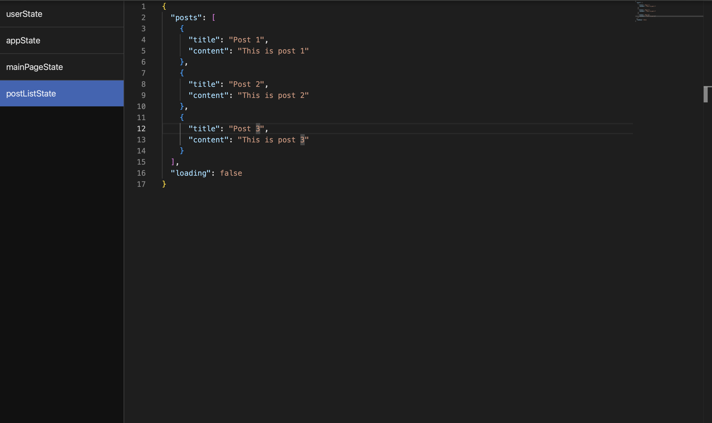

# `DebugShell`

A debugging tool for Web applications that helps developers easily track and visualize state and event data in the development process.



---

## API Overview

### Components

| Component               | Description       |
| ----------------------- | ----------------- |
| `<DebugShell />`        | Component         |
| `<DebugShellSidePanel>` | Wrapper Component |

### Hooks and Functions

| API             | Description                   |
| --------------- | ----------------------------- |
| `useDebugValue` | Hook for tracking state.      |
| `debugValue`    | Function for tracking events. |

---

## How to Use

### Side Panel Integration

Wrap your application with `<DebugShellSidePanel>` to enable the debug shell as side panel:

```tsx
import React from 'react'
import { DebugShellSidePanel } from 'debug-shell'

const App = () => {
  return (
    <DebugShellSidePanel>
      <YourApp />
    </DebugShellSidePanel>
  )
}
```

---

### Component Integration

Integrate the `<DebugShell>` as component in your app. You dont need a wrapper component for this:

```tsx
import React from 'react'
import { DebugShell } from 'debug-shell'

const App = () => {
  const userState = {
    name: 'TestUser',
    age: 23,
    email: 'test@test.com',
  }

  const handleClick = (event) => {
    debugValue('onClickEvent', event)
  }

  useDebugValue('userState', userState)

  return (
    <div>
      <h1>Welcome to the App</h1>
      <button onClick={handleClick}>Click Me</button>
      <DebugShell />
    </div>
  )
}
```

---

### Hook for State Tracking

To monitor state, use the `useDebugValue` hook:

```tsx
import React from 'react'
import { useDebugValue } from 'debug-shell'

const MyComponent = () => {
  const userState = {
    name: 'TestUser',
    age: 23,
    email: 'test@test.com',
  }

  useDebugValue('userState', userState)

  return <p>Name: {userState.name}</p>
}
```

---

### Function for Event Tracking

To monitor events, use the `debugValue' function:

```tsx
import React from 'react'
import { debugValue } from 'debug-shell'

const MyComponent = () => {
  const handleClick = (event) => {
    debugValue('onClickEvent', event)
    alert('Button clicked!')
  }

  return <button onClick={handleClick}>Click Me</button>
}
```

### **Key Features**

- **State and Event Tracking:**
  - Use `useDebugValue` to monitor component state.
  - Use `debugValue` to monitor events.
- **Developer-Friendly:** Easy to integrate, no changes to your app's structure. No provider or context required.

---

### **Installation**

```bash
npm install debug-shell
```

---
